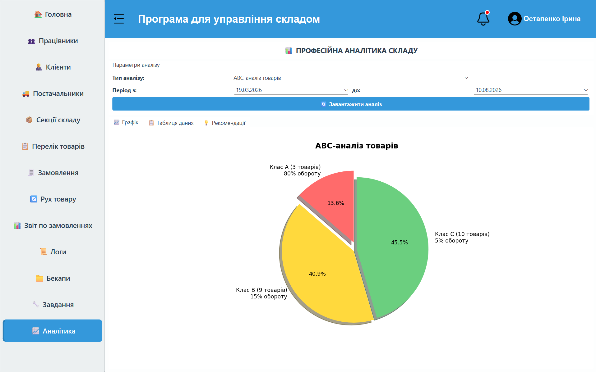
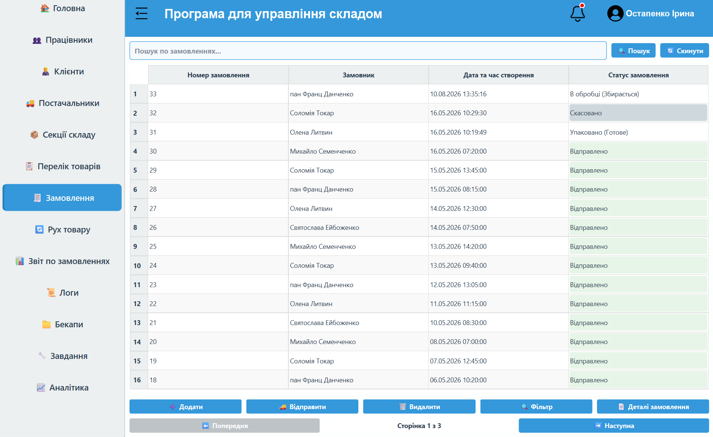
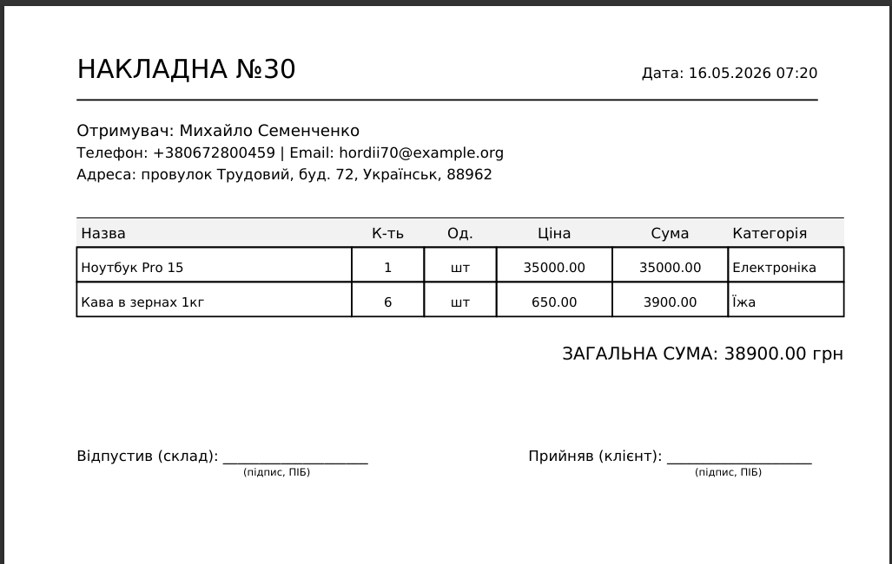
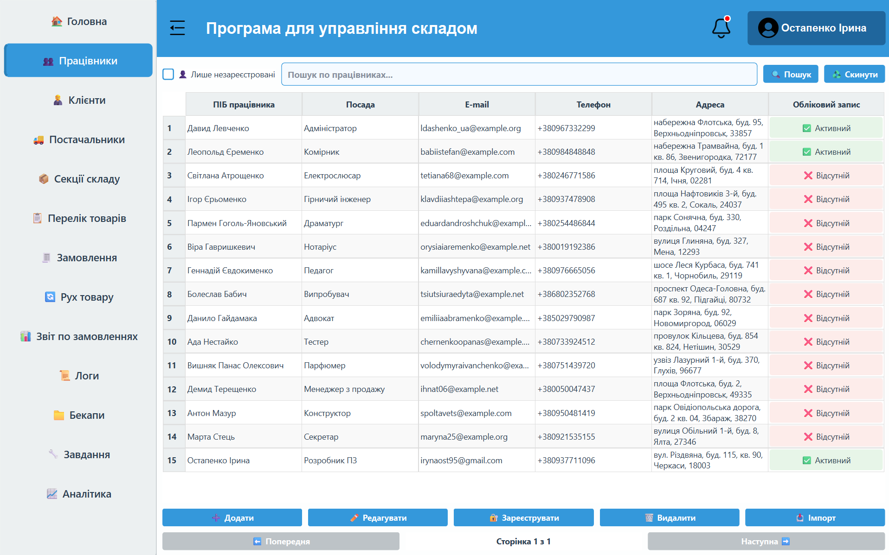
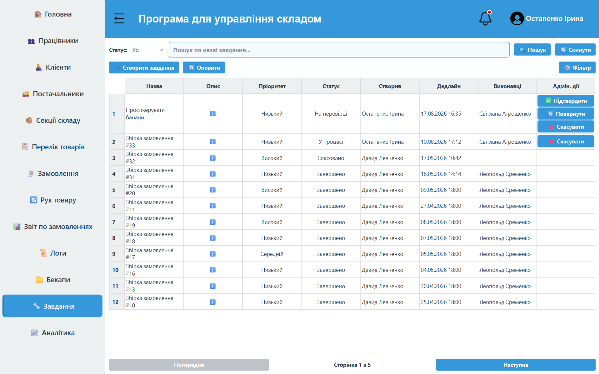
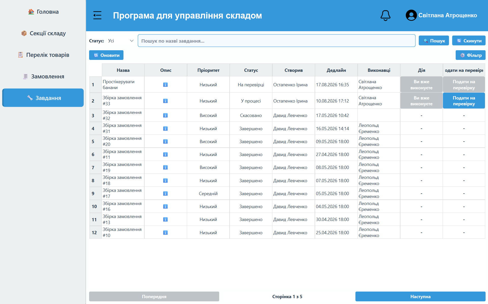

# 📦 WMS — Warehouse Management System

A client-server software solution designed to automate warehouse logistics, inventory control, order management, and sales analytics with Role-Based Access Control (RBAC).

[](https://youtu.be/MjUcPJJZPIw)

> ℹ️ **Note on Video Demo:** The video demonstration was recorded earlier in development. Since then, system security has been upgraded — database backups are now fully encrypted using `BACKUP_SECRET_KEY` and additional security protocols have been implemented.

---

## 🛠 Tech Stack

| Component | Technologies |
| :--- | :--- |
| **Backend** | Python 3.13, FastAPI, Uvicorn, PyMySQL, ReportLab (PDF) |
| **Frontend** | Python 3.13, PyQt6 |
| **Database** | MySQL Server 8.0 |
| **Containerization** | Docker, Docker Compose |

---

## 🎨 Interface & Screenshots

> Screenshots and generated documents are saved in `docs/`.

| Warehouse Analytics | Orders Management |
| :---: | :---: |
|  |  |

| PDF Invoice Generation | Employees Management |
| :---: | :---: |
|  |  |

| Task Management (Admin) | Worker Workspace (Employee) |
| :---: | :---: |
|  |  |

---

## 🔑 Demo Account & Authentication

For quick testing and system evaluation, use the default administrator credentials:

* **Username:** `admin`
* **Password:** `admin12345`

### Access Control Matrix (RBAC)

| Module / Tab | 👑 Administrator | 💼 Manager | 👷 Worker / Warehouseman |
| :--- | :---: | :---: | :---: |
| **Employees** | ✅ | ❌ | ❌ |
| **Logs & Backups** | ✅ | ❌ | ❌ |
| **Analytics & Reports** | ✅ | ✅ | ❌ |
| **Clients & Suppliers** | ✅ | ✅ | ❌ |
| **Orders** | ✅ | ✅ | ✅ |
| **Warehouse Sections & Products** | ✅ | ✅ | ✅ |
| **Tasks** | ✅ (Create/Control) | ✅ | ✅ (Execute) |

---

## 🚀 Quick Start

### Option 1. Running via Docker (Recommended / Primary)

Docker fully automates the environment setup. It automatically spins up MySQL 8.0, initializes the database schema with default tables and roles, builds the Python backend, and launches the FastAPI server. **No manual database configuration or backend dependency installation is required.**

1. **Clone the repository:**
   ```bash
   git clone [https://github.com/masteryjinn/warehouse_management_system.git](https://github.com/masteryjinn/warehouse_management_system.git)
   cd warehouse_management_system
   ```

2. **Start the backend server and database in Docker:**
   ```bash
   docker-compose up --build -d
   ```
   * Backend API will be available at: `http://localhost:8000`
   * Interactive API documentation (Swagger UI): `http://localhost:8000/docs`

3. **Install client dependencies and launch the GUI app:**
   ```bash
   pip install -r requirements.txt
   python frontend/main.py
   ```

---

### Option 2. Manual Setup (Fallback / Without Docker)

Use this method only if Docker is unavailable on your system.

1. **Database Setup:**
   * Install MySQL Server 8.0 locally.
   * Create a database named `WarehouseDB`.
   * Import the structure, functions, and seed data from `init_db/warehouse.sql`.

2. **Install Dependencies:**
   ```bash
   pip install -r requirements.txt
   ```

3. **Run Backend Server:**
   ```bash
   cd backend
   uvicorn main:app --reload
   ```

4. **Run Frontend Client (in a separate terminal):**
   ```bash
   python frontend/main.py
   ```

---

## 📁 Repository Structure

```text
warehouse_management_system/
├── backend/
│   ├── init_db/
│   │   └── warehouse.sql     # Database dump for automatic Docker initialization
│   ├── database/             # Database connection & SQL queries
│   ├── routes/               # FastAPI endpoints & controllers
│   ├── fonts/                # TrueType fonts for Cyrillic PDF generation
│   ├── logs/                 # Application event logs
│   └── main.py               # FastAPI application entry point
├── frontend/
│   ├── tabs/                 # UI tab modules (PyQt6)
│   ├── windows/              # UI window modules (PyQt6)
│   └── main.py               # Desktop application entry point
├── docs/                     # Interface images for documentation
├── docker-compose.yml        # Docker multi-container configuration
├── Dockerfile                # Backend container build instructions
└── requirements.txt          # Python dependency manifest
```
